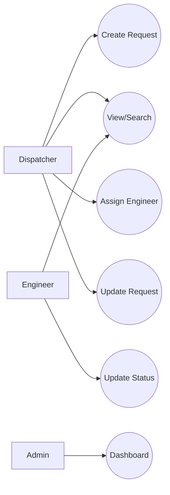
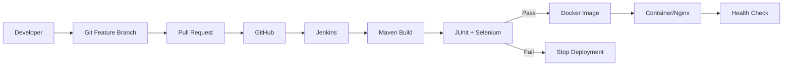

# Diagrams

## Use case

```mermaid
flowchart LR
D[Dispatcher] --> C((Create Request))
D --> V((View/Search))
D --> A((Assign Engineer))
D --> U((Update Request))
E[Engineer] --> V
E --> S((Update Status))
Admin[Admin] --> H((Dashboard))
```

## DevOps lifecycle

```mermaid
flowchart LR
A[Developer] --> B[Git Feature Branch] --> C[Pull Request] --> D[GitHub] --> E[Jenkins]
E --> F[Maven Build] --> G[JUnit + Selenium]
G -->|Pass| H[Docker Image] --> I[Container/Nginx] --> J[Health Check]
G -->|Fail| X[Stop Deployment]
```
